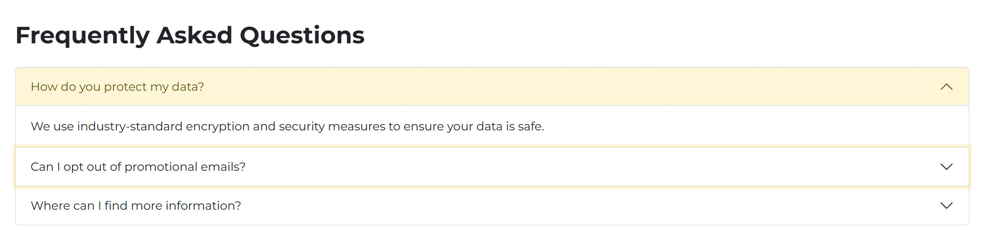

# BookMySpot

## Description

BookMySpot is a web application designed to connect drivers in need of parking spaces with owners willing to rent out their spots. It focuses on providing a seamless and user-friendly experience for all types of users, including administrators, parking space owners, and drivers.

#### What Problem It Solves

- Difficulty in locating available parking spaces in busy areas.
- Inefficient use of empty parking spots owned by residents and businesses.
- Lack of a unified platform for connecting drivers and parking space owners.

#### Target Users

1. **Administrators**: Responsible for managing users and ensuring smooth operation of the platform.
2. **Parking Space Owners**: Individuals or businesses with unused parking spaces they want to rent out.
3. **Drivers**: People in need of convenient and reliable parking solutions.

#### Key Objectives

- Provide a seamless platform for reserving and renting parking spaces.
- Enhance user experience with a responsive and accessible design.
- Foster trust between users through a rating and review system.

## Future Features

- **Admin Panel**:
  - Allows administrators to manage users and parking listings, ensuring smooth platform operation.
- **Parking Space Owners**:
  - Register and list parking spots.
  - Manage availability using a calendar system.
  - Set hourly or daily rates for renting spots.
- **Drivers**:
  - Search for parking spots via a map-based interface or by postcode.
  - Reserve parking spots for immediate or future use.

### Current Features

- **Home Page**:

  - The home page and all the pages' navbar are fully responsive, ensuring seamless usability across large screens, tablets, and mobile devices:  
      
    

  - Hero section highlighting the main introduction area where a search form will be incorporated in future updates:  
    

  - Features section providing an overview of the app’s primary functionalities and advantages:  
    

  - "How Does It Work" section describing the step-by-step process for finding and booking parking spots:  
    

  - Team section presenting the developers and key contributors behind the website:  
    

  - Testimonials section showcasing feedback and reviews from customers:  
    

  - Contact Us section offering a form for users to reach out with inquiries or feedback:  
    

  - Home page footer, uniquely styled compared to other pages:  
    

- **About Us Page**:

  - Hero section featuring a brief introduction to the purpose of the page:  
    

  - "Who We Are" section highlighting the team and their backgrounds:  
    

  - Values section showcasing the principles that drive trust, collaboration, and innovation:  
    

  - Team section providing contact links for team members to foster collaborations. This section includes interactive modals, allowing users to click on team members' details for more information and a brief description:  
    
    
    

- **Privacy Policies Page**:

  - Hero section featuring a brief introduction to the purpose of the page:  
    

  - Privacy and conditions section providing explanations of the platform's policies:  
      
    

  - Frequently Asked Questions (FAQ) section at the end of the page:  
    

- **Form Submit Page**:

  - After submitting the contact form on the Home Page, users are redirected to the Form Submit Page. In the future, this will send emails and connect to the database. Currently, it captures the input fields and displays them in a table format, as shown below:  
    

### Planned Features (In Progress)

- **Database Integration**:
  - A backend system to store and retrieve user and parking spot data.
- **Profile Pages**:
  - Dedicated pages for both parking space owners and drivers to manage their accounts and view history.
- **Search and Booking System**:
  - A fully functional search engine integrated with the database to display available spots dynamically.
- **Ratings System**:
  - Allowing users to rate parking spaces and other users after transactions.
- **Accessibility Features**:
  - Incorporating screen reader compatibility and keyboard navigation to accommodate users with disabilities.

## Technologies

### Used Technologies

This project utilizes a range of tools and technologies to ensure a seamless and professional development process, optimized performance, and user-friendly design. Below is a breakdown of the technologies used:

- **HTML**: For structuring the web pages and content.
- **CSS**: For styling and layout, ensuring a visually appealing and responsive design.
- **JavaScript**: For adding interactivity and dynamic features to the website.
- **Bootstrap 5.3**: A front-end framework used for building responsive and mobile-first layouts efficiently.
- **Font Awesome 5**: For incorporating scalable vector icons that enhance the visual design and usability.
- **VSCode**: A lightweight, powerful code editor used for writing, debugging, and managing the codebase.
- **GitHub**: A version control platform used for hosting the project repository and managing code changes collaboratively.
- **Snipping Tools**: For capturing screenshots to document features and workflows.
- **JPEG Imager**: Used to reduce image sizes, optimizing website performance and load times.
- **XL Converter**: A tool for compressing and converting images to the `.avif` format, further reducing image sizes while maintaining quality.
- **ChatGPT**: Assisted in identifying and resolving errors, as well as refining and rephrasing texts for improved clarity and professionalism.
- **GitHub Desktop**: A graphical interface for Git, simplifying version control tasks such as commits, branching, and syncing with the remote repository.
- **Balsamiq**: A wireframing tool used to create low-fidelity designs that serve as blueprints for the project's layout and user interface.

## Technologies Will Be Used

- PHP (or Python with Django/Flask)
- MySQL (or MongoDB for NoSQL)
- Advanced JavaScript & jQuery (or TypeScript for type-safe development)
- npm and other relevant libraries
- SCSS/SASS for advanced CSS styling
- Docker for containerization and deployment
- AWS services for scalable deployment and storage

## Installation

1. Clone the repository:
   ```bash
   git clone https://github.com/ie3ul2df/BookMySpot
   ```
2. Navigate into the directory:
   ```bash
   cd bookmyspot
   ```
3. Open `index.html` in your browser.

### Deployment

Host on a Local Server
To run the project properly, it is recommended to use a local server such as Live Server in VSCode or a tool like XAMPP.

- Using Live Server (VSCode):

  - Open the project folder in VSCode.
  - Install the Live Server extension from the VSCode marketplace.
  - Right-click on index.html and select Open with Live Server.

- Using XAMPP:

  - Copy the project folder to the htdocs directory in your XAMPP installation.
  - Start the Apache server using the XAMPP Control Panel.
  - Access the project by navigating to http://localhost/bookmyspot in your web browser.
  - Optional Deployment to GitHub Pages

- To make the project publicly accessible online:

  - Push the project to a GitHub repository (if not already done).
  - Go to the repository settings on GitHub.
  - Under the Pages section, set the branch to main (or the branch where your project is stored) and save.
    The project will be accessible at:
    https://<your-username>.github.io/BookMySpot/
    Now your project is ready for testing and live deployment!

### User Stories

#### Administrator

1. As an **Administrator**, I want to log in securely so I can manage the platform.
2. As an **Administrator**, I want to view a dashboard so I can see an overview of the platform's activity.
3. As an **Administrator**, I want to add, update, or remove user accounts so I can maintain the integrity of the system.
4. As an **Administrator**, I want to review and approve parking spot listings so I can ensure their quality and accuracy.
5. As an **Administrator**, I want to manage reported issues or disputes so I can resolve conflicts effectively.
6. As an **Administrator**, I want to view and analyze reports on system usage and transactions so I can make informed decisions for platform improvements.

#### Parking Space Owner

1. As a **Parking Space Owner**, I want to register for an account so I can list my parking spaces.
2. As a **Parking Space Owner**, I want to log in securely so I can manage my listings.
3. As a **Parking Space Owner**, I want to create new parking spot listings so I can rent them out.
4. As a **Parking Space Owner**, I want to upload images of my parking spots so drivers can see what they look like.
5. As a **Parking Space Owner**, I want to set hourly and daily rates for my spots so I can earn income from them.
6. As a **Parking Space Owner**, I want to mark my spots as unavailable on specific dates using a calendar so I can manage their availability.
7. As a **Parking Space Owner**, I want to edit or delete my parking spot listings so I can keep the information accurate.
8. As a **Parking Space Owner**, I want to view my booking history so I can track my earnings and spot usage.
9. As a **Parking Space Owner**, I want to receive ratings from drivers so I can build credibility.
10. As a **Parking Space Owner**, I want to see my average rating so I can monitor my reputation.

#### Driver

1. As a **Driver**, I want to search for available parking spots near a specific location so I can find a convenient place to park.
2. As a **Driver**, I want to filter search results by price, distance, and availability so I can find the best match for my needs.
3. As a **Driver**, I want to view parking spot details, including photos and ratings, so I can make an informed decision.
4. As a **Driver**, I want to register for an account so I can book parking spots.
5. As a **Driver**, I want to log in securely so I can manage my bookings.
6. As a **Driver**, I want to book a parking spot for immediate use so I can secure it right away.
7. As a **Driver**, I want to schedule a booking for a future date so I can plan ahead.
8. As a **Driver**, I want to pay for parking spots through the platform so I can complete transactions securely.
9. As a **Driver**, I want to leave a rating for the parking space and its owner after my booking so I can provide feedback.
10. As a **Driver**, I want to view my booking history so I can keep track of past reservations.

#### General User Stories

1. As a **User**, I want a responsive website so I can use it on my mobile, tablet, or desktop.
2. As a **User**, I want an accessible design so I can navigate the platform regardless of my abilities.
3. As a **User**, I want a clean and intuitive interface so I can find and use features easily.
4. As a **User**, I want to reset my password if I forget it so I can regain access to my account.
5. As a **User**, I want to receive email notifications for booking confirmations or updates so I stay informed.

## UX-Design

### User Research

Before starting the design, research was conducted to understand the target users and their needs. This helped define the core functionalities of the platform and how it should be structured.

- **Target Audience**: The main users are drivers looking for parking spaces and parking space owners willing to rent out their spots.
- **User Needs**: Drivers need a quick and easy way to find and book parking spots. Parking space owners need an intuitive way to list, manage, and update their parking spots.

### Information Architecture

The site is structured to meet the needs of both parking space owners and drivers. Key pages and features include:

- **Home Page**: A landing page that introduces the platform and allows users to navigate to the key sections.
- **Login/Register**: Authentication pages for users to sign in or create an account.
- **Search Page**: A map-based interface where drivers can search for available parking spots.
- **Profile Page**: Users can view and manage their profile, bookings, and spots (for owners).
- **Admin Dashboard**: For admins to manage users, listings, and monitor platform activity.

### Wireframes

Wireframes are visual representations of the layout of each page of the application, focusing on functionality and placement of elements rather than design details. These wireframes include mobile, tablet, and desktop versions to ensure the design is responsive.

- **Home Page**: Shows the welcome message, navigation, and search bar.
- **Search Page**: Displays a map and list of available parking spots.
- **Login/Register Page**: Contains forms for user registration and login.
- **Profile Page**: Displays user profile information and options to update details or view bookings.
- **Admin Dashboard**: A page for the admin to manage users and listings.

Below are the wireframes for the main pages of the BookMySpot website.

### Homepage Wireframe

The Homepage wireframe outlines the basic structure and layout of the main landing page. It includes navigation, a hero section, features, testimonials, and a footer. This page is designed to give visitors an overview of the platform.


---

### Login & Register Page Wireframe

The Register page wireframe displays the layout of the user registration form, including fields for personal information, username, password, and a submit button. This page is where new users will sign up for the platform. This page is incuded 3 diffrent forms for login, register and forgot password which are switching with javascript by the links on the buttom of the forms.


---

### About Us Page Wireframe

The About Us page wireframe displays the layout for the company’s introduction. It includes sections about the team, the mission of the platform, and how BookMySpot works. This page is designed to help users understand the purpose of the platform and the people behind it.


### Mockups

Once the wireframes were finalized, high-fidelity mockups were created to define the visual style, color scheme, and typography of the platform. These mockups provide a clearer idea of how the final site will look.

- **Home Page**: Features a clean and simple design with a strong call to action (CTA) for users to start searching for parking spots.
- **Login/Register Page**: Simple form design with clear instructions.
- **Search and Booking Page**: A user-friendly map interface with filters to help drivers find parking spaces easily.
- **Profile and Admin Pages**: Organized with easy-to-use controls for managing listings, bookings, and account settings.

### Home page Mockup

"Below, I have included the homepage mockup as it contains the most elements. The other pages can be easily understood, as they follow the same theme throughout the website."


### Custom Colors

In order to give the platform a unique identity, the default Bootstrap colors have been customized to fit the branding of **BookMySpot**. The primary color scheme has been adjusted to incorporate a warm, yellow tone for the primary actions, and a dark theme for text and buttons.

The following custom color palette is applied throughout the platform:

- **Primary Color**: #fed136 (Bright Yellow) - Used for key actions like buttons and highlights.
- **Primary Text Emphasis**: #665416 (Dark Yellow) - Used for text and accents.
- **Primary Background Subtle**: #FFF6D7 (Light Yellow) - Used for backgrounds in light mode.
- **Primary Border Subtle**: #FFEDAF (Soft Yellow) - Used for borders around buttons and forms.

### Button Customizations

All buttons have been customized to match the primary branding color, offering distinct hover, active, and disabled states:

- **Primary Button**:

  - Background Color: #fed136 (Bright Yellow)
  - Hover Color: #FED854 (Lighter Yellow)
  - Active Color: #FEDA5E (Even Lighter Yellow)

- **Outline Primary Button**:

  - Border Color: #fed136 (Bright Yellow)
  - Hover Background Color: #fed136 (Bright Yellow)
  - Active Background Color: #fed136 (Bright Yellow)

- **Dark Button**:

  - Background Color: #212529 (Dark Grey)
  - Hover Background Color: #1C1F23 (Darker Grey)
  - Active Background Color: #1A1E21 (Very Dark Grey)

- **Outline Dark Button**:
  - Border Color: #212529 (Dark Grey)
  - Hover Background Color: #212529 (Dark Grey)
  - Active Background Color: #212529 (Dark Grey)

### Why These Colors?

The chosen color palette was designed to enhance the usability and appeal of the site, ensuring a modern, approachable look while maintaining functionality.

- **Yellow** represents warmth, energy, and attention, making it the perfect choice for the primary action buttons and highlights.
- **Dark Grey** provides a contrasting, neutral tone for buttons and text, ensuring readability and a clean, minimalistic appearance.
- **Soft accents** and subtle shades of yellow contribute to a welcoming, easy-on-the-eyes interface for the users.

### UX Principles

The design follows key UX principles to ensure that the platform is intuitive, easy to navigate, and visually appealing. These include a focus on responsive design, accessibility, and consistent visual cues.

The overall experience was designed with the user in mind, providing:

- **Simplicity**: Clear, easy-to-use interfaces.
- **Consistency**: A consistent color scheme and button styles across the platform.
- **Responsiveness**: The platform adjusts seamlessly to different screen sizes (mobile, tablet, desktop).
- **Accessibility**: Color contrast and screen reader support for users with disabilities.

### Responsive Design

The design is fully responsive, ensuring that the platform works seamlessly across different devices, including mobile phones, tablets, and desktops. The layout adjusts dynamically based on the screen size, offering an optimal user experience.

- **Mobile Design**: The layout is simplified with a focus on essential features like search and booking.
- **Tablet/Tablet Landscape**: More content is displayed side-by-side with larger images or maps.
- **Desktop Design**: Full layout with detailed information, including map views and side panels.

### Accessibility

To ensure the platform is accessible to all users, including those with disabilities, the following measures were taken:

- **Keyboard Navigation**: All interactive elements are navigable using the keyboard.
- **Screen Reader Support**: ARIA labels and roles have been added to ensure compatibility with screen readers.
- **Color Contrast**: The color scheme adheres to WCAG guidelines to ensure sufficient contrast for readability.

### Design Decisions and Rationale

- **Simplicity and Clarity**: The design focuses on providing a clean, intuitive interface with clear calls to action to make the booking process as straightforward as possible.
- **Mobile-First Design**: Given the importance of mobile use for drivers on the go, the design was first created for mobile devices and then scaled for larger screens.
- **User-Centric Features**: Features like the map-based search and rating system were designed to directly address user needs and preferences.

## Testing

### Validation Tools

To ensure the quality and compliance of the code with web standards, the following tools were used to validate HTML and CSS:

- **Manual Testing**:

  - Tested all links to ensure they are working.
  - Checked responsiveness on mobile, tablet, and desktop.
  - Verified form inputs and error handling.
  - The website was tested on multiple devices (mobile, tablet, desktop) to ensure that it is fully responsive.
  - Browser testing was conducted on the latest versions of Chrome, Firefox, Safari, and Edge to ensure compatibility.

### **Automated Testing**:

- **Lighthouse Report**

  **Home Page:**

  - Performance : 100/100
  - Accessibility : 100/100
  - Best Practices : 96/100
  - SEO : 100/100
    
    **About Page:**
  - Performance : 100/100
  - Accessibility : 100/100
  - Best Practices : 100/100
  - SEO : 100/100
    
    **Privacy Page:**
  - Performance : 100/100
  - Accessibility : 100/100
  - Best Practices : 100/100
  - SEO : 100/100
    

1. **HTML Validation**:

   Tool: [W3C HTML Validator](https://validator.w3.org/)
   This tool was used to validate the HTML code to ensure it adheres to W3C standards, helping to detect and fix any potential issues in the markup.

   - Home Page, index.html file:
     
   - About us Page, about-us.html file:
     
   - Privacy and Policies Page, privacy.html file:
     
   - Form submit Page, privacy.html file:
     

2. **JavaScript Validation**:

Used [Jest](https://jestjs.io/) for unit tests.

- agancy.js file:
  
- form-submit.js file:
  

3. **CSS Validation**:

Tool: [W3C CSS Validator](https://jigsaw.w3.org/css-validator/)
The CSS code was validated using this tool to ensure that the stylesheets are free from syntax errors and compliant with CSS standards.

- Style.css file:
  

### Bug Tracking

- **Footer Alignment Issue**:  
  The footer was not staying at the bottom of the page on short-content pages. This issue was resolved by using Bootstrap's `d-flex` class on the `<body>` element and `flex-grow-1` on the `<main>` element, ensuring the footer remains anchored to the bottom of the viewport.

- **Navbar Active Page Highlighting**:  
  The navbar did not correctly indicate the active page or section on load or during scrolling. The issue was resolved by implementing JavaScript logic to dynamically update the active state of navbar links and dropdown items based on the current URL and scroll position.

- **Contact Form Field Validation**:  
  The contact form lacked proper input validation, allowing invalid data to be submitted. This was resolved by adding appropriate HTML5 attributes (`type`, `required`, and `pattern`) to ensure that the inputs for name, email, and phone adhere to valid formats.

### Testing Results

- **HTML Validator**: No major issues were found after running the validation.
- **CSS Validator**: A few minor warnings were addressed, ensuring proper syntax and consistency across all styles.
- **Autoprefixer**: All relevant CSS rules were successfully prefixed to ensure compatibility across browsers.

## Site-map

### Current Site-map

- **Home**
  - Hero
  - Features
  - How Does It Work?
  - Testimonials
  - Meet Our Team
  - Contact Us
- **About Us**
  - Hero
  - Who We Are
  - Our Values
  - Meet Our Team
- **Privacy and Policies**
  - Hero
  - Privacy Policy
  - Terms and Conditions
  - Frequently Asked Questions
- **Form Submit**
  - submited form table

### Future Full Site-map

This project going to have all the below pages in the next releases:

- **Home**
  - Search Parking Spots
    - Map View
    - Filter Options (Date, Price, Location)
  - Featured Listings
  - Call to Action
    - Sign Up
    - Login
- **About Us**
  - Team Members
  - Mission & Vision
  - Contact Information
- **Privacy Policy**
- **User Authentication**
  - Login
  - Registration
    - Driver Registration
    - Parking Space Owner Registration
  - Password Reset
- **Dashboard (Role-Based)**
  - Admin Dashboard
    - Manage Users
    - Manage Listings
    - Reports & Analytics
    - Handle User Issues
  - Parking Space Owner Dashboard
    - Manage Listings
    - Calendar Availability
    - Pricing Settings (Hourly/Daily)
    - Booking Requests
    - Reviews & Ratings
  - Driver Dashboard
    - Search & Book Spots
    - Booking History
    - Manage Profile
    - Reviews & Ratings
- **Search Results**
  - List View
  - Map View
- **Booking Process**
  - Booking Details
  - Payment
  - Confirmation Page
- **User Profile**
  - View Profile
  - Edit Information
  - Change Password
  - Booking History
- **Contact Us**
  - Contact Form
  - Support Information
- **FAQ / Help Center**
  - Common Queries
  - How-to Guides
- **Legal**
  - Terms of Service
  - Privacy Policy
- **Error Pages**
  - 404 Not Found
  - 500 Server Error

## Github Deployment Address

### GitHub Pages

This project is deployed on **GitHub Pages**, making it accessible online for anyone to view. The deployment process involves pushing the project code to a GitHub repository, which automatically generates a live link to the website.

The deployed version of this project can be accessed at the following URL:
[https://ie3ul2df.github.io/BookMySpot/](https://ie3ul2df.github.io/BookMySpot/)

## Credits

### Tutorials & Documentation

- Code Institute for frontend tutorials: [Codeinstitute](https://codeinstitute.net/)
- W3Schools for HTML, CSS, and JavaScript tutorials: [W3Schools](https://www.w3schools.com)
- MDN Web Docs for JavaScript and web standards: [MDN Web Docs](https://developer.mozilla.org/)
- Chatgpt for refinements and brainstormings [Chatgpt](https://chatgpt.com)

### Libraries & Frameworks

- Bootstrap 5.3 for responsive design: [Bootstrap](https://getbootstrap.com/)
- Font Awesome 5 for icons: [Font Awesome](https://fontawesome.com/)
- jQuery for JavaScript library: [jQuery](https://jquery.com/)

### Images & Media

- Images sourced from Pexels: [Pexels](https://pexels.com)
- Hero Image from Adobe Firefly: [Adobe Firefly](https://firefly.adobe.com/)
- Icons by Font Awesome: [Font Awesome](https://fontawesome.com/)
- Login / Register page bg gif animation: [Pinterest](https://uk.pinterest.com/)

### Code Snippets

- Code snippets for form validation from Stack Overflow: [Stack Overflow](https://stackoverflow.com/)
- Solution for async/await in JavaScript from GitHub Gists: [GitHub Gists](https://gist.github.com/)

### Future Open Source Contributions

- Express.js for server-side framework: [Express.js](https://expressjs.com/)
- Node.js for backend platform: [Node.js](https://nodejs.org/)

### Font Resources

- Google Fonts for font selection: [Google Fonts](https://fonts.google.com/)

### Third-Party APIs

- Google Maps API for map features, will be added in the next releases: [Google Maps API](https://developers.google.com/maps)
- Stripe API for payments, will be added in the next releases: [Stripe API](https://stripe.com/docs/api)

### Licenses

- MIT License for open-source libraries: [MIT License](https://opensource.org/licenses/MIT)

## Contact

If you have any questions or suggestions, feel free to reach out to me:

- Email: [arash11javadi@gmail.com](mailto:arash11javadi@gmail.com)
- GitHub: [https://github.com/ie3ul2df](https://github.com/ie3ul2df)
- LinkedIn: [www.linkedin.com/in/arash12javadi](www.linkedin.com/in/arash12javadi)
